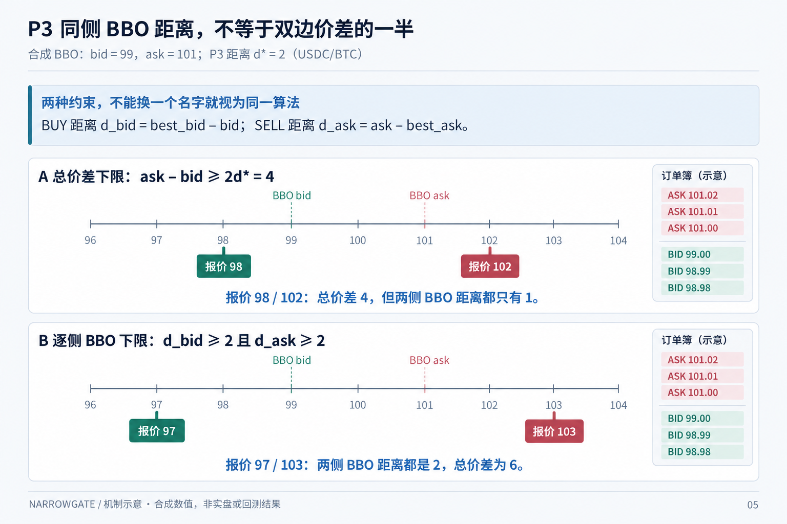

# F02: new 407-day research

[English](README.md) | [简体中文](README.zh-CN.md)

Last materially modified: 2026-10-11

Last materially synchronized: 2026-10-11

## Questions and entry points

This family owns packages 3, 6 in the [unified plan](../../RECOMPUTE_407.md); see the [machine-readable work list](../../recompute_407.json). A plan is not an execution receipt.

## Implementation and new results

Static P3 has a new train-only input adapter; conditional and reach-time surfaces still need integration.

Full new-study results are not delivered here; private evidence is not distributed. Interface tests cannot replace coverage, sample/censoring denominators or prediction-to-action-to-order-to-fill-to-inventory-to-net-PnL evidence.

## Inputs, units and evaluation

Use the shared 407-day source and strategy-visible clocks. Freeze feature/label/action units, candidate budgets, parent artifacts and splits. Purge by actual outcome ends; training and selection do not read final data, and previous-use remains. Fix initial accounts, delays, fill eligibility, fees, real funding and terminal inventory MTM. Missing is not zero; intents are not fills.

## Reproduction and limitations

P3 distance is measured outward from the same-side BBO, not as half the total quote spread. With best bid 99 and best ask 101, quotes 98 / 102 have a total spread of 4 but a same-side distance of only 1 on each side; distances of 2 require boundary quotes 97 / 103. This synthetic example distinguishes constraints, not economic performance or implementation acceptance.

*Mechanism illustration / synthetic values / not live or backtest results. A total-spread floor does not establish a per-side BBO-distance floor.*

Choose actual APIs through the [new-input guide](../../INPUT_MIGRATION.md), without defaulting to old models, dates or rankings. Distinguish not run, missing input, valid negative and valid positive results. Incomplete fork state is not checkpoint equivalence; simulation does not prove native/live fill parity.

## Historical context

Earlier work explored these mechanisms under its original data and execution identities. One private snapshot preserves the pre-rewrite tree; existing historical docs are traceability only, not current closure states or permission to reopen final data.
