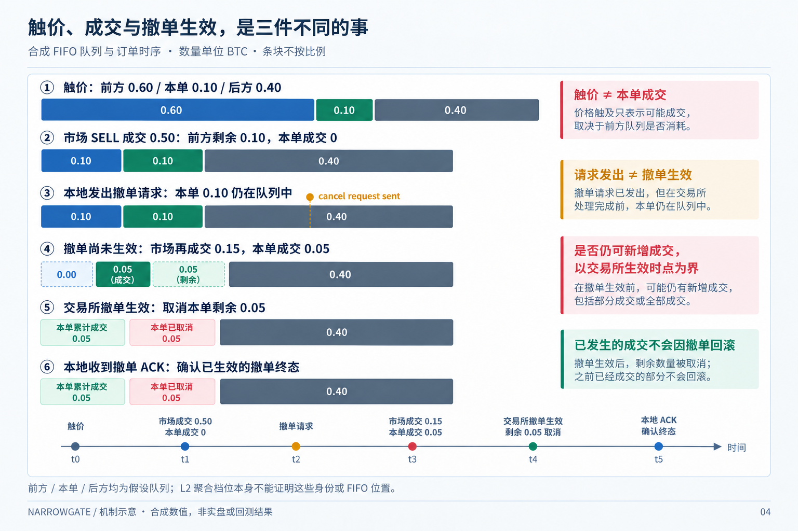

# F08: new 407-day research

[English](README.md) | [简体中文](README.zh-CN.md)

Last materially modified: 2026-10-11

Last materially synchronized: 2026-10-11

## Questions and entry points

This family owns packages 2 in the [unified plan](../../RECOMPUTE_407.md); see the [machine-readable work list](../../recompute_407.json). A plan is not an execution receipt.

## Implementation and new results

Closed visible-Bar side flow exists. Individual execution counts cannot stand in for native parent packets; new hazard fits remain pending.

That statement concerns the historical side-flow/hazard route, not every subsequent F08 study. Its closed, incomplete and negative findings remain unchanged.

The separate [trade–book response action-value study](response_baseline.md) completed 204 independent accounts / 407 days. Its frozen candidate became the subsequent research reference `B0_RESPONSE_20261007`; all-in net PnL is -1603.031182 USDC, still a loss. The report distinguishes the 47-feature model and 39-feature history ablation, original identities, one-time Final reuse, previous-use and complete accounting. Private evidence is retained locally, not distributed; this is not an unfinished economic run. Live adapters exist, but code, offline validation and real-environment admission are reported separately. Historical hazard findings and [F07 U1](../f07_active_order_continuation/README.md) were not promoted by this result.

## Inputs, units and evaluation

Use the shared 407-day source and strategy-visible clocks. Freeze feature/label/action units, candidate budgets, parent artifacts and splits. Purge by actual outcome ends; training and selection do not read final data, and previous-use remains. Fix initial accounts, delays, fill eligibility, fees, real funding and terminal inventory MTM. Missing is not zero; intents are not fills.

## Reproduction and limitations

Touch, own-order fill, cancel request, exchange-effective cancellation and local ACK are distinct events. In the synthetic FIFO example below, market executions of 0.50 and 0.15 BTC produce own-order fills of 0 and 0.05 BTC respectively. Cancellation removes the remaining 0.05 BTC at the exchange-effective time; the later local ACK confirms that terminal state. If the effective timestamp is absent, local ACK alone cannot identify the exact end of exchange exposure. Aggregated L2 does not establish these assumed queue identities.

*Mechanism illustration / synthetic values / not live or backtest results. A sent request is not an effective cancellation; already executed fills are not rolled back.*

Choose actual APIs through the [new-input guide](../../INPUT_MIGRATION.md), without defaulting to old models, dates or rankings. Distinguish not run, missing input, valid negative and valid positive results. Incomplete fork state is not checkpoint equivalence; simulation does not prove native/live fill parity.

## Historical context

Earlier work explored these mechanisms under its original data and execution identities. One private snapshot preserves the pre-rewrite tree; existing historical docs are traceability only, not current closure states or permission to reopen final data.
